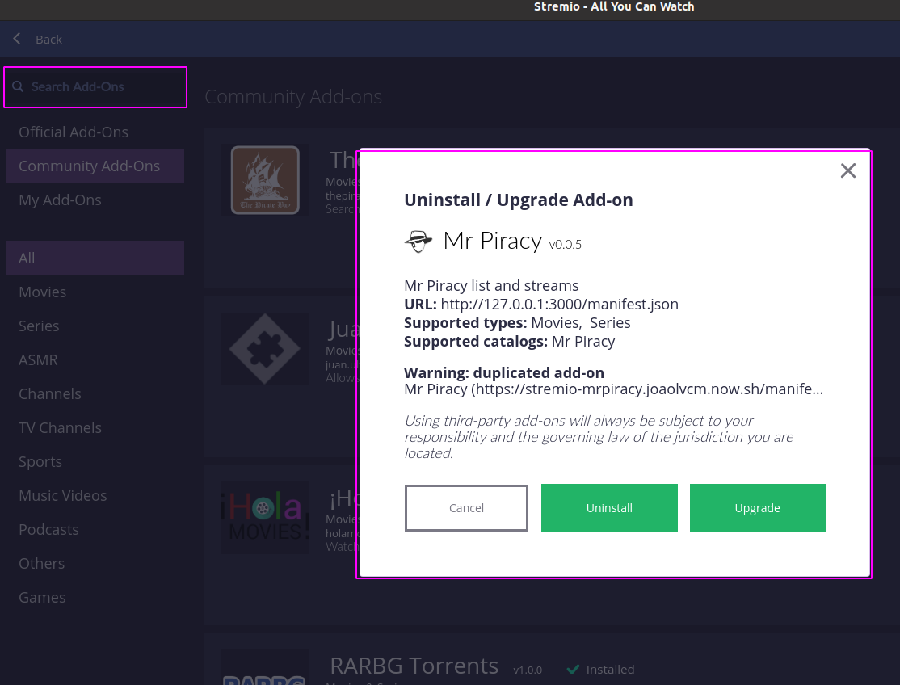

# Stremio addon for mrpiracy - show mrpiracy movies list and links


## Deploy It Yourself
[](https://heroku.com/deploy?template=https://github.com/jlvcm/stremio-mrpiracy)

## Docker It Yourself

[docker push joaolvcm/stremio-mrpiracy](https://hub.docker.com/repository/docker/joaolvcm/stremio-mrpiracy)

### How to ?
You will need to install docker and node in your computer

- Docker
    - [Windows](https://docs.docker.com/docker-for-windows/install/)
    - [Linux(Ubuntu)](https://docs.docker.com/engine/install/ubuntu/)
    - [Mac](https://docs.docker.com/docker-for-mac/install/) 
- Node
    - [Windows](https://blog.teamtreehouse.com/install-node-js-npm-windows)
    - [Linux(Ubuntu)](https://www.digitalocean.com/community/tutorials/how-to-install-node-js-on-ubuntu-20-04)
    - [Mac](https://blog.teamtreehouse.com/install-node-js-npm-mac) 


Then you will need to open a terminal and set the prompt inside a folder of your own (this command process will depend on your system) to retrieve the image into your computer
After setting up run:

```shell
docker pull joaolvcm/stremio-mrpiracy
```

Then retrieve the project from the github

```shell
git clone https://github.com/jlvcm/stremio-mrpiracy.git
```

You will see a new folder called `stremio-mrpiracy`, go inside and type:

```shell
cd stremio-mrpiracy
npm install
```

This will install the dependencies of this project
Start the server

```shell
node server.js
```

Copy the link and paste it in Stremio in the add-ons section input box
